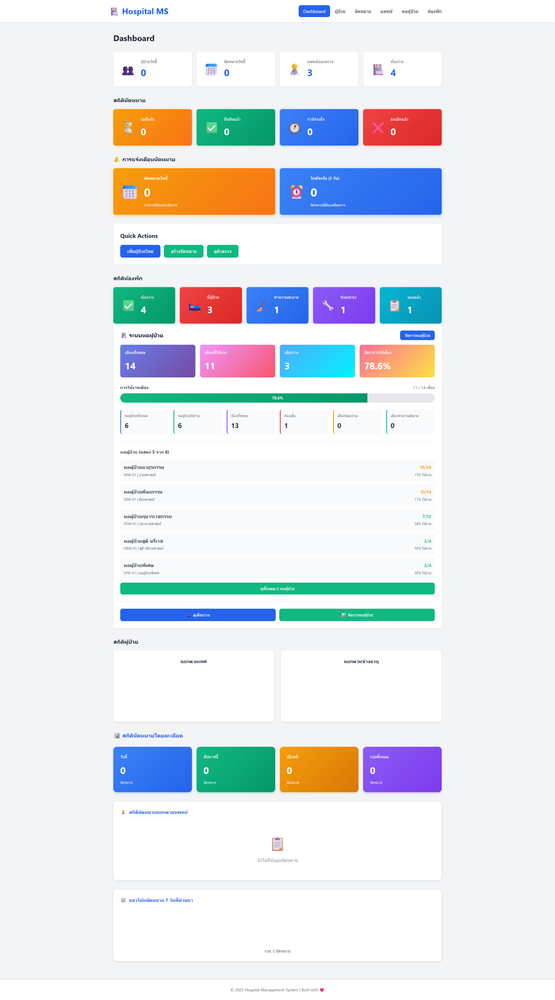
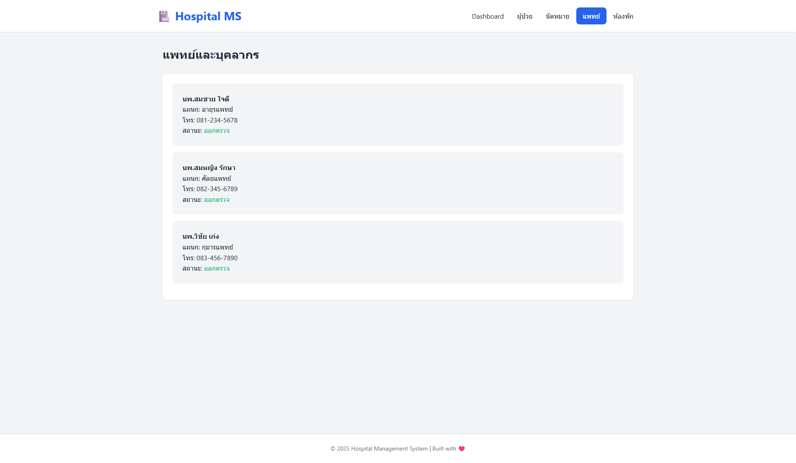
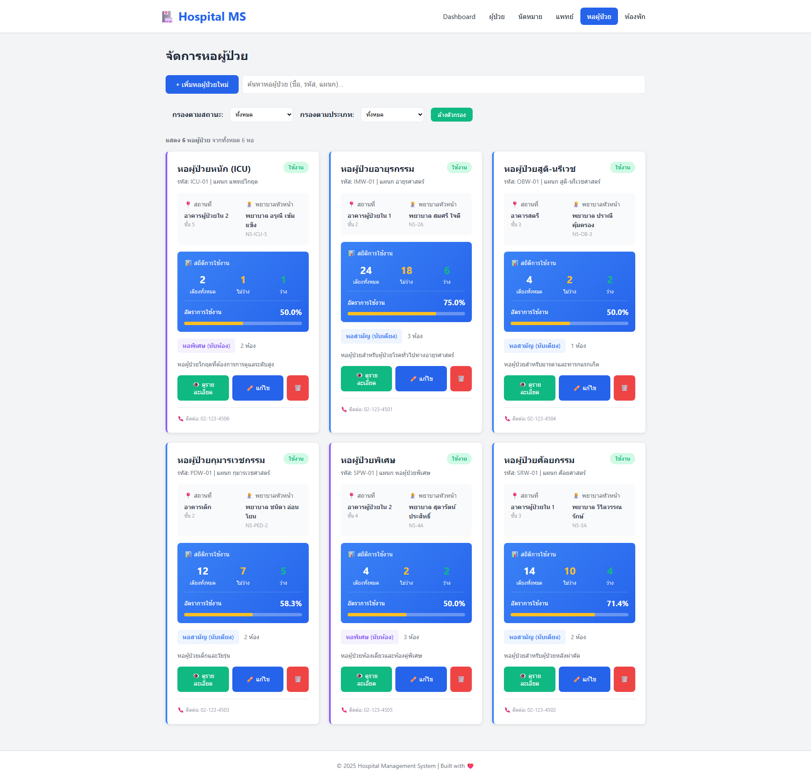
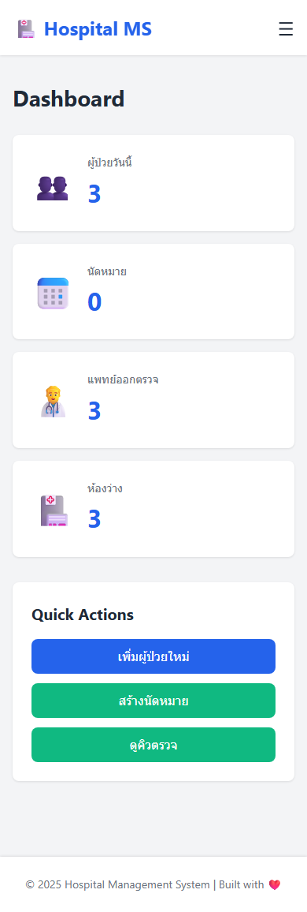

# 🏥 Hospital Management System

ระบบจัดการโรงพยาบาลแบบ Web-based รองรับการใช้งานบน Mobile และ Desktop

## 📋 Overview

โปรเจ็กต์นี้เป็นระบบจัดการโรงพยาบาลที่ครอบคลุมการทำงานหลักของโรงพยาบาล ตั้งแต่การลงทะเบียนผู้ป่วย การนัดหมาย การจัดการห้องพัก ระบบยา และการเงิน

**🎯 จุดประสงค์**: สร้างโปรเจ็กต์เพื่อฝึกฝนการเขียนโปรแกรม และสะสม GitHub contributions แบบต่อเนื่องทุกวัน

## ✨ Features

### 🔹 ปัจจุบัน (Day 1-21) - Version 2.3.0
- ✅ **Dashboard** - สถิติแบบ real-time พร้อมกราฟ
- ✅ **Patient Management** - ลงทะเบียน แก้ไข ค้นหา Export CSV
- ✅ **Appointment System** - จองนัดหมาย แก้ไข ยกเลิก พร้อมการแจ้งเตือน
- ✅ **Doctor Management** - ข้อมูลแพทย์ครบถ้วน พร้อมระบบ:
  - 📅 **Schedule Management** (Day 17) - ตารางเวลาแบบรายสัปดาห์
  - 🔄 **Status Management** (Day 18) - เปลี่ยนสถานะ (ออกตรวจ/ไม่ว่าง/ลาพัก)
  - 📊 **Performance Metrics** (Day 19) - วิเคราะห์ประสิทธิภาพ
  - 🏥 **Department Grouping** (Day 20) - จัดกลุ่มตามแผนก
  - 🔍 **Advanced Search & Filter** (Day 21) - ค้นหาแบบรวม
- ✅ **Ward Management System** - ระบบหอผู้ป่วย 3 ชั้น (wards → rooms → beds)
- ✅ **Room Management** - จัดการห้องพักทุกประเภท พร้อมราคา
- ✅ **Responsive Design** - รองรับ Desktop, Tablet, Mobile
- ✅ **Screenshots Documentation** - 34 ภาพครอบคลุมทุกฟีเจอร์

### 🔹 กำลังพัฒนา (Week 5-9)
- 💊 **Pharmacy & Medicine** (Week 5) - ระบบจัดการยาและสต็อก
- 💰 **Billing & Payments** (Week 6) - ระบบการเงินและประกันสังคม
- 📊 **Reports & Analytics** (Week 7) - รายงานและการวิเคราะห์ข้อมูล
- 🔐 **Security & Users** (Week 8) - ระบบ Authentication และบทบาท
- 🎨 **UI/UX Improvements** (Week 9) - Dark Mode และปรับปรุง UX

## 🚀 Quick Start

### Prerequisites
- **Node.js** 18.x or higher ([Download](https://nodejs.org/))
- **npm** 9.x or higher (comes with Node.js)
- **Web Browser** (Chrome, Firefox, Safari, Edge)
- **Text Editor** (VS Code recommended)

### การติดตั้ง

1. **Clone repository**
```bash
git clone https://github.com/yosasasutsut/hospital-management-system.git
cd hospital-management-system
```

2. **ติดตั้ง dependencies**
```bash
npm install
```

3. **รันโปรเจ็กต์**

**วิธีที่ 1: ใช้ npm scripts (แนะนำ)**
```bash
npm start
# หรือ
npm run dev
```
เปิดบราวเซอร์อัตโนมัติที่ http://localhost:8080

**วิธีที่ 2: เปิดไฟล์โดยตรง**
```bash
# เปิด index.html ด้วย browser
start index.html  # Windows
open index.html   # macOS
xdg-open index.html  # Linux
```

**วิธีที่ 3: ใช้ Python (ถ้าไม่มี Node.js)**
```bash
python -m http.server 8000
# เปิด http://localhost:8000
```

## 📁 โครงสร้างโปรเจ็กต์

```
hospital-management-system/
├── index.html              # หน้าหลัก
├── css/
│   └── styles.css         # Styles ทั้งหมด (Mobile-first)
├── js/
│   └── app.js            # JavaScript หลัก
├── assets/
│   ├── icons/            # Icons
│   └── data/             # Sample data (future)
├── images/               # Images
├── README.md            # คู่มือนี้
└── ROADMAP.md          # แผนพัฒนา 60 วัน
```

## 🎯 Development Roadmap

โปรเจ็กต์นี้มีแผนพัฒนา **60 วัน** แบ่งเป็น:

- **Week 1-2**: Patient & Appointment Management
- **Week 3-4**: Doctor & Room Management
- **Week 5-6**: Pharmacy & Billing System
- **Week 7**: Reports & Analytics
- **Week 8**: Security & User Management
- **Week 9**: UI/UX Improvements

📖 ดูรายละเอียดเพิ่มเติมใน [ROADMAP.md](ROADMAP.md)

## 💻 Tech Stack

### Core Technologies
- **HTML5** - Semantic markup with modern meta tags
- **CSS3** - Mobile-first responsive design with CSS Grid & Flexbox
- **JavaScript ES6+** - Vanilla JS with modern features
- **LocalStorage API** - Client-side persistent storage

### Development Tools
- **Node.js** 18+ - JavaScript runtime
- **npm** - Package manager
- **live-server** ^1.2.2 - Development server with auto-reload

### PWA Support
- **Web App Manifest** - Progressive Web App configuration
- **Service Worker** ready - For offline support (coming soon)

### Future Enhancements
- **Backend**: Node.js/Express or Python/Flask
- **Database**: MySQL, PostgreSQL, or MongoDB
- **Authentication**: JWT or OAuth 2.0
- **Real-time**: WebSocket or Socket.io
- **Testing**: Jest, Cypress

## 🎨 Screenshots

### 📸 Documentation (34 ภาพ)
ระบบมี screenshot ครบทุกฟีเจอร์:
- **Desktop**: 21 ภาพ - Dashboard, Patients, Doctors, Wards, Appointments, All Modals
- **Tablet**: 3 ภาพ - Responsive layouts (768x1024)
- **Mobile**: 6 ภาพ - Mobile UI (390x844)
- **Features**: 4 ภาพ - Form validation, Search, Empty states, Modals

📁 ดูภาพทั้งหมด: [`POC/`](POC/)

### Desktop View

*Dashboard แสดงสถิติแบบ real-time พร้อมกราฟ*


*ระบบจัดการแพทย์พร้อมฟีเจอร์ครบถ้วน*


*ระบบหอผู้ป่วยแบบ 3 ชั้น (Wards → Rooms → Beds)*

### Mobile View

*UI ปรับตัวอัตโนมัติสำหรับหน้าจอเล็ก*

## 🤝 Contributing

โปรเจ็กต์นี้เป็นส่วนตัวสำหรับการเรียนรู้ แต่ยินดีรับ suggestions หรือ feedback

### วิธีการ Contribute
1. Fork โปรเจ็กต์
2. สร้าง Branch ใหม่ (`git checkout -b feature/AmazingFeature`)
3. Commit การเปลี่ยนแปลง (`git commit -m 'feat: add some amazing feature'`)
4. Push ไปยัง Branch (`git push origin feature/AmazingFeature`)
5. เปิด Pull Request

## 📝 Commit Convention

โปรเจ็กต์นี้ใช้ [Conventional Commits](https://www.conventionalcommits.org/)

```
feat: เพิ่ม feature ใหม่
fix: แก้ไข bug
docs: เปลี่ยนแปลง documentation
style: เปลี่ยนแปลง style/formatting
refactor: ปรับปรุง code โดยไม่เปลี่ยน functionality
test: เพิ่ม tests
chore: งานอื่นๆ (build, dependencies)
```

### ตัวอย่าง
```bash
git commit -m "feat: add patient search functionality"
git commit -m "fix: correct date format in appointments"
git commit -m "docs: update README with new features"
```

## 🎓 Learning Resources

### หากคุณกำลังเรียนรู้การเขียนโปรแกรม
- [MDN Web Docs](https://developer.mozilla.org/) - HTML, CSS, JavaScript
- [JavaScript.info](https://javascript.info/) - JavaScript tutorial
- [CSS-Tricks](https://css-tricks.com/) - CSS techniques
- [Git Documentation](https://git-scm.com/doc) - Git & GitHub

### แนะนำสำหรับมือใหม่
1. เริ่มจาก features ง่ายๆ ก่อน
2. ทำทีละน้อยทุกวัน ดีกว่าทำครั้งเดียวเยอะ
3. อ่าน code ของคนอื่นบ้าง
4. ถาม ChatGPT/Claude เมื่อติดขัด
5. Commit บ่อยๆ อย่ากลัวผิด

## 📊 GitHub Contribution Tips

เพื่อให้ GitHub profile เขียวทุกวัน:

1. **Commit ทุกวัน** - แม้จะเป็นงานเล็กน้อย
2. **เวลาที่ดีที่สุด** - Commit ประมาณ 18:00-22:00 เพื่อนับเป็นวันนั้นๆ
3. **Quality > Quantity** - Code ที่ดีกว่า commits เยอะ
4. **Documentation** - เขียน README, comments ให้ดี
5. **Consistency** - สม่ำเสมอสำคัญกว่าเร็ว

## 📅 Development Log

### Day 17-21 - 2025-10-13 (Latest)
**Doctor Management Enhancement (Version 2.3.0)**
- ✅ **Day 17**: Doctor Schedule Management - ตารางเวลาแบบรายสัปดาห์ พร้อม time slots
- ✅ **Day 18**: Doctor Availability Status - 3 สถานะ (ออกตรวจ/ไม่ว่าง/ลาพัก) พร้อมกรอง
- ✅ **Day 19**: Doctor Performance Metrics - วิเคราะห์ประสิทธิภาพแพทย์แบบ real-time
- ✅ **Day 20**: Department Management - จัดกลุ่มแพทย์ตามแผนก
- ✅ **Day 21**: Advanced Search & Filter - ค้นหาแบบรวม (ชื่อ + แผนก + สถานะ)
- ✅ Screenshot Automation - 34 ภาพ (21 desktop + 13 responsive)
- ✅ Testing Documentation - TESTING.md พร้อม 80+ test items
- ✅ Bug Fix - Ward modal close issue แก้ไขแล้ว

### Day 15-16 - 2025-10-12
**Ward Management System (Version 2.1.0 - 2.2.0)**
- ✅ Ward Management System - 3-tier hierarchy (wards → rooms → beds)
- ✅ Ward CRUD operations with search and filter
- ✅ Room Management within wards (3 types: general, single, double)
- ✅ Bed Management with status tracking
- ✅ Bed Assignment System - มอบหมายและจำหน่ายผู้ป่วย
- ✅ Comprehensive demo data (6 wards, 13 rooms, 14 beds)
- ✅ Enhanced Doctor Profile Modal with 4 tabs
- ✅ Version bumped to 2.2.0

### Day 14 - 2025-10-12
**Appointment Statistics (Version 1.9.0)**
- ✅ Comprehensive appointment statistics system
- ✅ Statistics calculation functions (getAppointmentsByDoctor, getAppointmentsByDateRange, getAppointmentStatistics)
- ✅ Enhanced dashboard analytics section
- ✅ Time-based statistics cards (today, this week, this month, total)
- ✅ Doctor ranking Top 5 with confirmed/pending breakdown
- ✅ Weekly trend bar chart visualization with Thai weekday labels
- ✅ Modern gradient cards with color-coded statistics
- ✅ Responsive grid layouts and empty states
- ✅ JSDoc documentation for all statistics functions

### Day 13 - 2025-10-12
- ✅ Quick Edit Appointment Notes feature
- ✅ Inline note editing directly from appointment details modal
- ✅ Real-time character counter (0-500 characters) with color coding
- ✅ Auto-focus and cursor positioning for better UX
- ✅ Save and Cancel buttons for edit mode
- ✅ Enhanced notes display with emoji icons
- ✅ Empty state message for appointments without notes
- ✅ Note update timestamp tracking (noteUpdatedAt field)
- ✅ JSDoc documentation for all note functions
- ✅ Version bumped to 1.8.0

### Day 12 - 2025-10-11
- ✅ Appointment reminders system with notification badges
- ✅ getTodaysAppointments() helper function
- ✅ getUpcomingAppointments() helper function with configurable days
- ✅ updateAppointmentReminders() for badge updates
- ✅ Visual badges with gradient design (orange for today, blue for upcoming)
- ✅ Dynamic badge visibility based on reminder counts
- ✅ Integrated auto-loading on dashboard
- ✅ JSDoc documentation for all functions
- ✅ Version bumped to 1.7.0

### Day 11 - 2025-10-11
- ✅ Edit appointment functionality with pre-filled modal form
- ✅ Smart validation preventing edits to past/cancelled appointments
- ✅ Real-time form validation with error messages
- ✅ Status change capability (pending ↔ confirmed)
- ✅ Enhanced appointment data model with updatedAt tracking
- ✅ Auto-update dashboard after editing
- ✅ JSDoc documentation for edit functions
- ✅ Version bumped to 1.6.0

### Day 10 - 2025-10-10
- ✅ Comprehensive room management system with Thai pricing
- ✅ 5 room types (Ward, Semi-Private, Private, VIP, Suite)
- ✅ 7 status indicators with color coding
- ✅ Enhanced room display with modern card layout
- ✅ Room search and advanced filters (status, type, floor)
- ✅ Room details modal with complete information
- ✅ Room statistics on dashboard
- ✅ Amenities display and occupancy tracking
- ✅ Last cleaned timestamp with time calculation
- ✅ Responsive design for all devices
- ✅ Version bumped to 1.5.0

### Day 9 - 2025-10-10
- ✅ Enhanced appointment list view with full details
- ✅ Sort appointments by date and time (newest first)
- ✅ Color-coded cards for past/upcoming appointments
- ✅ Status badges (pending, confirmed, cancelled)
- ✅ View appointment details modal
- ✅ Cancel appointment functionality
- ✅ Thai date formatting for better UX
- ✅ Responsive appointment cards with modern design
- ✅ Version bumped to 1.4.0

### Day 8 - 2025-10-09
- ✅ Appointment booking system
- ✅ Create new appointment form with modal
- ✅ Select patient and doctor from dropdowns
- ✅ Date and time picker with validation
- ✅ Optional notes field
- ✅ Auto-update dashboard after creation
- ✅ Version bumped to 1.3.0

### Day 7 - 2025-10-07
- ✅ Patient statistics dashboard with Chart.js
- ✅ Gender distribution pie chart
- ✅ Age group distribution bar chart
- ✅ Real-time chart updates
- ✅ Version bumped to 1.2.0

### Days 4-6 - 2025-10-06
- ✅ Edit patient information functionality
- ✅ Delete patient with confirmation dialog
- ✅ Export patient data to CSV
- ✅ Patient search and filter by age range

### Day 3 - 2025-10-05
- ✅ Modern development setup with npm & package.json
- ✅ PWA support with manifest.json
- ✅ Enhanced HTML meta tags (SEO, Open Graph, Twitter)
- ✅ Updated to latest web standards
- ✅ Version bumped to 1.1.0
- ✅ Improved documentation

### Day 2 - 2025-10-05
- ✅ Enhanced patient registration (gender, birth date, address)
- ✅ Auto-calculate age from birth date
- ✅ Form validation with error messages
- ✅ Patient search functionality
- ✅ JSDoc documentation
- ✅ Code quality improvements

### Day 1 - 2025-10-05
- ✅ โครงสร้างโปรเจ็กต์
- ✅ HTML/CSS/JavaScript foundation
- ✅ Dashboard พื้นฐาน
- ✅ ระบบผู้ป่วยเบื้องต้น
- ✅ Responsive design

## 🐛 Known Issues

- LocalStorage มีข้อจำกัดเรื่องขนาดข้อมูล (~5-10MB)
- ข้อมูลจะหายเมื่อ clear browser cache
- ยังไม่มี multi-user support

## 🔮 Future Enhancements

- [ ] Backend API (Node.js/Express)
- [ ] Database (MySQL/PostgreSQL)
- [ ] User Authentication
- [ ] Real-time updates (WebSocket)
- [ ] Mobile App (React Native)
- [ ] Cloud Deployment (AWS/Azure)
- [ ] Integration กับระบบประกันสังคม

## 📄 License

This project is created for educational purposes.

## 🙏 Acknowledgments

- คุณทุกคนที่ให้คำแนะนำ
- Community ที่ช่วยแชร์ความรู้
- AI assistants ที่ช่วยในการเรียนรู้

## 📞 Contact

- GitHub: [@yosasasutsut](https://github.com/yosasasutsut)
- Email: wongwarit.b@gmail.com

---

⭐ ถ้าคุณชอบโปรเจ็กต์นี้ อย่าลืม Star ให้ด้วยนะ!

**Made with ❤️ for learning**
